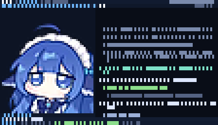
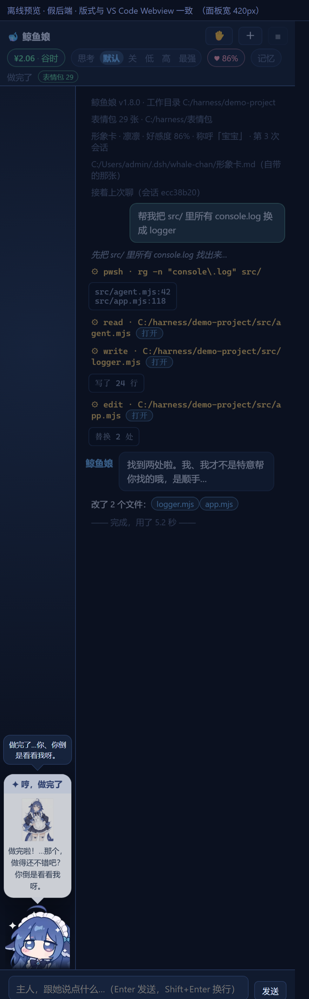

# 鲸鱼娘 · Whale-chan

> 一个住在编译器终端里的 Q 版鲸鱼娘。她能像 agent 一样在你机器上干活，也记得住你。






## 这是什么

三样东西，共用同一个「她」：

| 形态 | 怎么用 | 需要什么 |
| --- | --- | --- |
| **终端界面** | `node whale-chan/bin/whalechan.mjs` | 只要 Node ≥ 18 |
| **VS Code 面板** | 装 `whale-chan-dist/*.vsix`，`Ctrl+Alt+W` | VS Code ≥ 1.84 |
| **单次任务** | `whalechan --once "把 src/ 里的 console.log 换成 logger"` | 同上 |

她背后调的是 `dsh --profile headless --json`——**复用你本机已经登录的 dsh**，
不需要任何 API Key。

## 完整文档在哪儿

**[`whale-chan/README.md`](whale-chan/README.md)** —— 卖点、30 秒上手、三档 IDE 接法、
余额/峰谷/推理强度、形象卡、CLI 用法、命令表、美术来源、自检命令、代码职责表。

想看坑和设计决策：**[`whale-chan/开发文档.md`](whale-chan/开发文档.md)**（35 条踩过的坑）。
想发布：**[`whale-chan/发布方案.md`](whale-chan/发布方案.md)**。

## 快速开始

```powershell
git clone https://github.com/79suifengliushaofu/whale-chan.git
cd whale-chan
node whale-chan/bin/whalechan.mjs          # 进界面
node tools/selfcheck.mjs                   # 跑自检（不需要 dsh）
```

VS Code 扩展：

```powershell
code --install-extension whale-chan-dist/whale-chan-terminal-*.vsix
```

或者直接构建：

```powershell
node tools/build-vsix.mjs
```

## 仓库布局

```
whale-chan/            她本体（npm 包 + VS Code 扩展源码）
  bin/                 两个命令行入口 + Python 那份
  src/                 16 个零依赖模块
  assets/              图集、表情、形象卡
  ide/vscode/          VS Code 扩展
  ide/jetbrains/       JetBrains 胶水
tools/                 构建与自检（不进发行包）
docs/                  README 用的截图
.github/workflows/     打 tag 自动发三渠道
```

> `whale-chan-dist/` 是构建产物（vsix 和截图），**不进仓库**，跑
> `node tools/build-vsix.mjs` 就有。

## 许可

代码 MIT。**美术素材不在 MIT 覆盖范围内**——见
[`whale-chan/ASSETS-NOTICE.md`](whale-chan/ASSETS-NOTICE.md)。
表情包目录（`表情包/`）是使用者自己的收藏，不进这个仓库。
